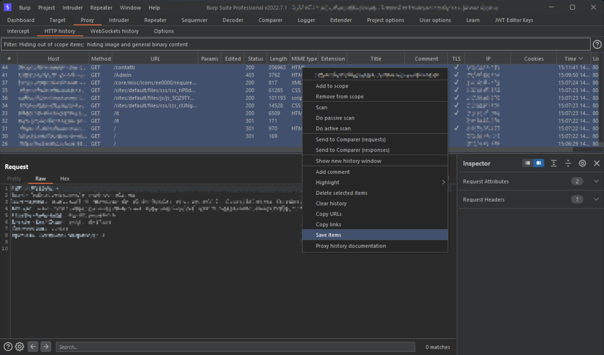
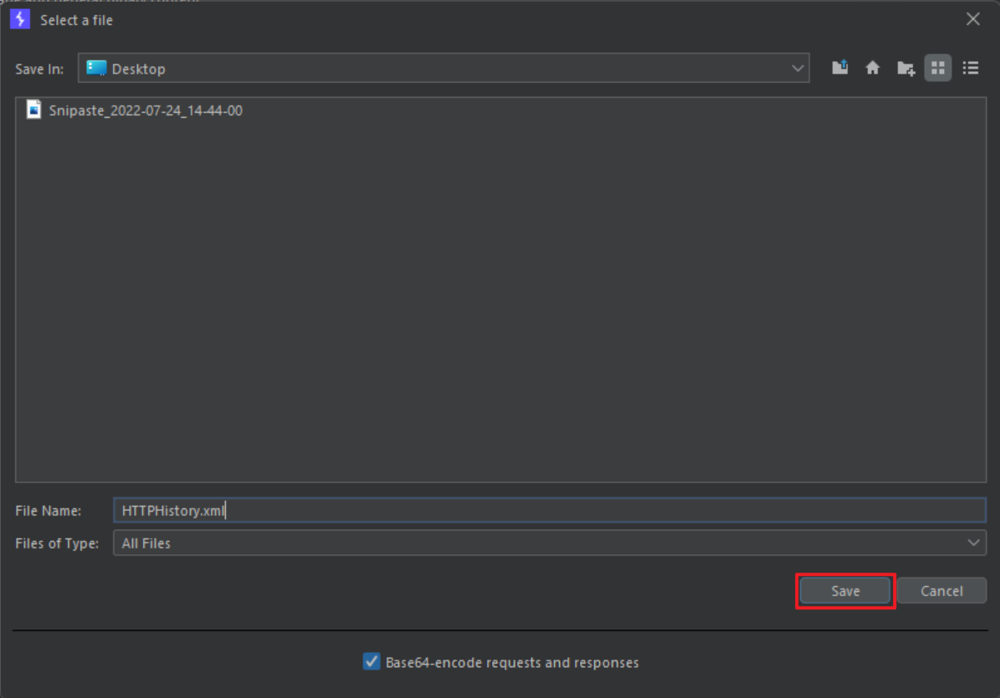

# Burp HTTP History parser
The program will parse HTTP responses, specified in **base64** format in the `HTTPHistory.xml` file obtained from selection of `Save Items` in Burp Suite **HTTP History**, for example:

- Step 1
    

- Step 2
    

After decoding responses in `xml` file, the script will analyse the presence and possible values inserted for some HTTP Security headers and `Set-Cookie` header.

## Installation
```bash
pip3 install xml beautifulsoup4 openpyxl alive-progress
```
or<br>
```bash
pip3 install -r requirements.txt
```
