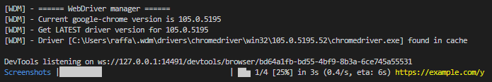

# Web Archive
The program will perfom GET requests to some target URLs and take screenshots of the responses using selenium. 

## Installation
```bash
pip3 install -r requirements.txt
```

## Cheat sheet
The program will need several resources (organized as provided in the github repository): 
- `targets.txt` is the TXT file with the list of target domains.
- `template` is the folder where all default resources for generation of HTML pages are.

The program will automatically create a new folder named with timestamp information (e.g. `results20220925-18_51_59`), by duplicating `template` folder.
This folder will contain results organized as follows:
- `html`: folder containing the final HTML pages (i.e. `domains.html`, `index.html`, `status_codes.html`). 
    - `css`: folder containing CSS files for style of HTML pages;
    - `images`: folder containing screenshots taken by the program, bar graphs and all default images for web pages;
    - `js`: folder containing javascript source code needed by web pages.
- `images`: folder containing results screenshots, readable without web pages and organized by domains.

### Version with data structures
```bash
python3 scan_with_data_structs.py
```

### Version with DB
```bash
python3 scan_with_DB.py
```

## Example execution


